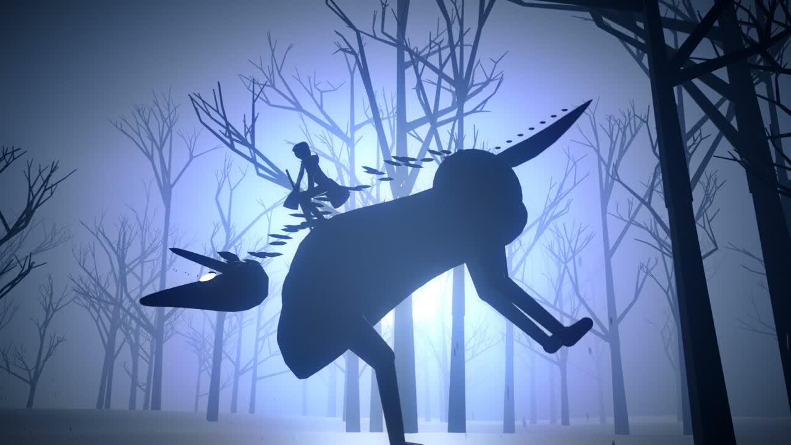
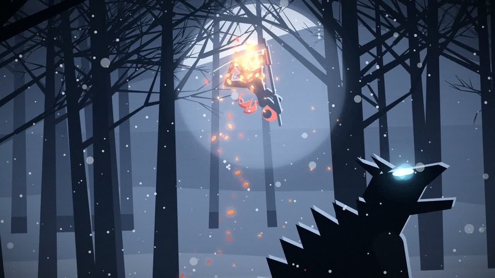

# EMBER

> **New: [EMBER III · KINDLE](ep3b/)** is 64 seconds of anime-style action, hand-animated entirely in JavaScript with no video models. [Watch it (media/ember3.mp4)](media/ember3.mp4)
>
> 
>
> For comparison, the [video-model take of III](ep3/) is kept as a reference.
>
> **[EMBER II · ASH](b3d/)** is a 52-second 3D sequel built headless in Blender from Python. It's grittier and physics-grounded. [Watch it (media/ember2.mp4)](media/ember2.mp4)
>
> 



A 30-second action short inspired by Monty Oum's *Red* trailer, generated entirely in code: score, sound design, animation, camera and grading. It contains no hand-drawn frames or samples and no external assets.

▶ **[Watch it (media/ember.mp4)](media/ember.mp4)** · full-quality master on the [Releases page](../../releases)

A lone hooded huntress with a recoil-driven gun-scythe fights a pack of void wolves in a moonlit forest. The palette is monochrome blue-black, and the only warm colours are her cloak and the embers she leaves behind: warmth against entropy.

## How it's built

Everything is keyed to one cue sheet (`common.py`): 128 BPM, 16 bars = exactly 30.0 s. The score, the SFX, the choreography, hit-stops, slow-motion and camera shake all read the same clock, so every hit lands on its frame and its sample.

| File | What it does |
|---|---|
| `common.py` | Timeline, cue sheet, easing, time-warp (hit-stop / slow-mo) |
| `audio.py` | Synthesized score and sound design: piano, formant choir, amp-simmed guitars, drums, bass, lead, convolution reverb, sidechain, mastering |
| `rig.py` | IK biped with gun-scythe, procedural quadruped wolves |
| `choreo.py` | Keyframed choreography, ballistic arcs, contact solving, spring camera |
| `world.py` | Parallax forest, moon, snow, particles, FX, bloom and grading |
| `render.py` | Cloth-simulated cloak, smears, afterimages, event FX, ffmpeg output |

Some craft notes:

- **Music follows the story.** The theme opens on solo piano, returns on the lead during the fight, and is stripped back to exposed piano for the slow-motion break. The alpha wolf enters on a Phrygian E♭ chord. After 14 bars of D minor, the final cleave resolves to a Picardy-third D major.
- **Weight comes from physics.** Every jump and knockback is a real ballistic solve in warped time, so slow-mo stretches the physics instead of retiming keyframes. Each wolf's leap is solved backward from where the blade or kicking foot will be at the hit time, so contacts always land. The recoil shots are what move her.
- **Follow-through comes from simulation.** The cloak is Verlet cloth driven by relative air velocity.
- **Anime and Monty staging:** held anticipation, hit-stop, inverted impact frames, blade smears sampled at sub-frame times, delayed-kill slash seams, and a spring-lagged camera with shake and punch-zoom.

## Render it yourself

```bash
python3 -m venv .venv && .venv/bin/pip install -r requirements.txt   # needs cairo + ffmpeg (brew install cairo ffmpeg)
.venv/bin/python audio.py                  # -> out/ember.wav   (~8 s)
.venv/bin/python render.py --video         # -> out/ember.mp4   (~4.5 min on an M2 Pro)
ffmpeg -i out/ember.mp4 -i out/ember.wav -map 0:v -map 1:a -c:v copy -c:a aac -b:a 320k out/ember_final.mp4
```

`render.py --preview 7.5,17.8,23.2` renders individual frames to `scratch/prev/` for quick iteration.

---
Made with [Claude Code](https://claude.com/claude-code).
