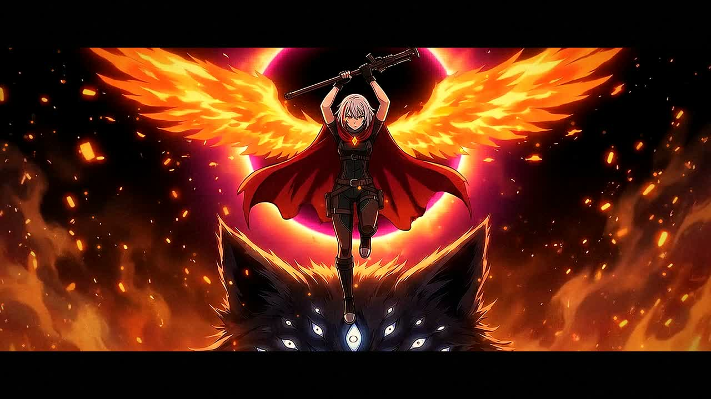

# EMBER III · 点火 KINDLE (video-model take)

▶ **[Watch it (media/ember3_veo.mp4)](../media/ember3_veo.mp4)**. The full master is on the [v3.0-veo release](https://github.com/bishpls/ember/releases/tag/v3.0-veo).

This is a 72.8-second anime-style episode made with generative models, kept here as a **reference and a cautionary tale**. It led to a hand-animated retake (see `ep3b/`).

## Pipeline
1. **Designs:** a character sheet, the weapon, the wolves and the Hollow King, made with Gemini 3 Pro Image ("Nano Banana Pro"). Files are in `refs/`.
2. **Keyframes:** 30 shots, each generated with the design sheets as reference images (see `board/keyboard_v1.jpg`).
3. **Motion:** Veo 3.1 image-to-video, with two takes per shot (Lite and Fast) and native-1080p Standard for three hero shots. The picks are in `edit.py`.
4. **Compositor (`edit.py`):** beat-locked at 150 BPM, retimed on ones/twos/threes with hit-stop, plus impact frames, smears, speed lines, embers, grade and title.
5. **Score (`score3.py`):** the house synth engine. D minor, a dark detuned chord for the King, a lift to E minor at the ignition, and an E-major dawn.

Total generation spend was $35.26, logged per call in `ledger.jsonl`.

## Verdict
The keyframes held up, but the motion didn't. Once a video model drives the animation, it decides the acting, the timing and the physics, and its taste shows through every cut: floaty, morphing and generic. Compositing can't fix that. The retake throws out the video model entirely and animates everything by hand in code.
