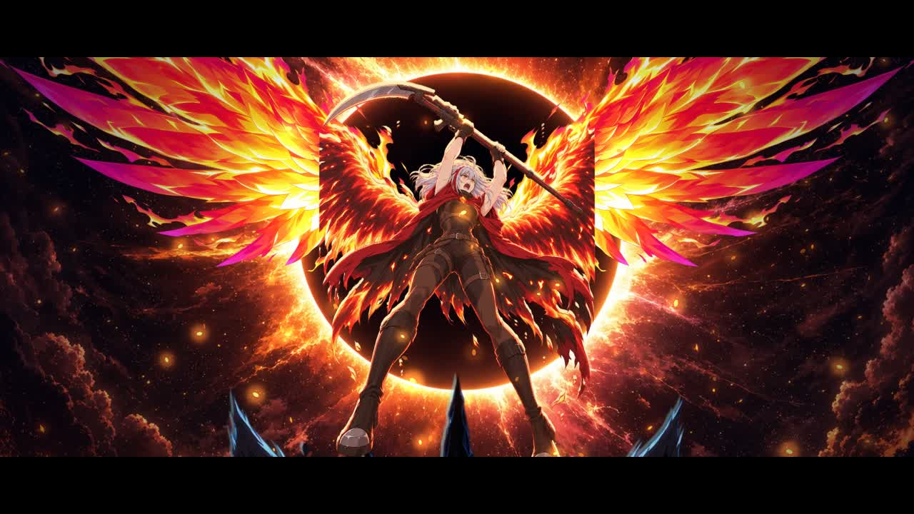

# EMBER III · 点火 KINDLE: studio-pipeline version (Round 4)

▶ **[Watch it (media/ember3_studio.mp4)](../media/ember3_studio.mp4)** · master on the [v4.0 release](https://github.com/bishpls/ember/releases/tag/v4.0)

This is 67 seconds of anime made the way a TV studio divides the work. Claude directs, lays out, times and composites. An image model (`gpt-image-2`) does the draftsmanship, drawing each key and in-between onto Claude's layouts. **No video models are used.**

| Role | Who | Where |
|---|---|---|
| Storyboard and layouts (pose guides for every drawing) | Claude | `STORYBOARD.md`, `manifest.py` (coloured joint-guides, in-betweens interpolated between keys) |
| Character, prop, creature and effects settei | gpt-image-2 | `refs/`, `props/`, `fx/` |
| Key and in-between drawings (~60) | gpt-image-2, drawn *into* the guides with the model sheet and neighbouring drawings as references | `draw/`, `keys/` |
| Painted backgrounds | gpt-image-2 | `bg/` |
| Exposure sheets (drawing per frame on ones, twos or threes), camera, hit-stop, smears, impact frames, secondary motion within held drawings, effects timing, compositing and grade | Claude | `film/` |
| Score and sound design, locked to the same beat map | Claude (synth) | `score4.py` |

Generation for this round cost about $15 (85 images). The running total across every EMBER episode is $53.70.

Build: `python score4.py && node film/main.js --range 0 168 --out out/picture.mp4` (or 4 parallel chunks). For contact sheets: `node film/main.js --sheet s09_spin`.
